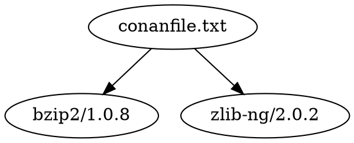

# 소스 코드, 패키징, 의존성 관리

### 참고자료

* CMake
    * Tutorial - [Step 7: Packaging an Installer](https://cmake.org/cmake/help/latest/guide/tutorial/Packaging%20an%20Installer.html)
* [An Introduction to Modern CMake - Finding Packages](https://cliutils.gitlab.io/modern-cmake/chapters/packages.html)
* CppCon 2018 [Mateusz Pusz "Git, CMake, Conan - How to ship and reuse our C++ projects"](https://www.youtube.com/watch?v=S4QSKLXdTtA)
* https://github.com/TheLartians/PackageProject.cmake
* https://github.com/cpm-cmake/CPM.cmake
* Conan C/C++ Package Manger
    * [Getting Started](https://docs.conan.io/en/latest/getting_started.html)
    * [Integration/CMake](https://docs.conan.io/en/latest/integrations/build_system/cmake.html)

## 스터디 노트

오늘 다룰 것들은 소스코드와 패키지의 관리입니다.
먼저 짧은 CMakeLists.txt를 작성하고 시작하겠습니다.

Boost 라이브러리를 익히기 위한 가상의 연습 프로젝트를 상상해봅시다.

```cmake
cmake_minimum_required(VERSION 3.19)
project(boost_test_suite VERSION 2021.0814.1 LANGUAGES CXX)

list(APPEND CMAKE_MODULE_PATH ${PROJECT_SOURCE_DIR}/build)
```

미리 준비된 라이브러리를 사용할 것이므로 IMPORTED Target을 찾을 것입니다.

```cmake
find_package(BZip2 REQUIRED) # BZip2::BZip2
find_package(OpenSSL REQUIRED) # OpenSSL::SSL OpenSSL::Crypto
find_package(Boost REQUIRED) # Boost::filesystem
```

단순히 빌드 상태를 확인하는 것이 아니고, 배포를 상정하고 있다면 일종의 고유 식별자가 필요한 경우가 있을 것입니다.

보통 소스코드의 버전과 패키지의 버전을 같게 보기도 하지만, 분리하여 생각하는 것이 좋습니다.
이는 소스코드는 같더라도, 프로그램을 생성하는 시점에 빌드 환경에 설치된 툴체인과 빌드시스템의 버전을 구분할 필요가 있기 때문입니다.

먼저 소스코드의 버전을 의미하는 GIT_COMMIT_ID를 획득합니다.

```cmake
find_package(Git REQUIRED)
execute_process(
    COMMAND "${GIT_EXECUTABLE}" rev-parse HEAD
    WORKING_DIRECTORY ${PROJECT_SOURCE_DIR}
    OUTPUT_VARIABLE GIT_COMMIT_ID
    OUTPUT_STRIP_TRAILING_WHITESPACE
)
```

이번에는 패키지의 버전으로는 (다소 부족하지만) **빌드시스템 파일을 생성한 시각**을 사용하겠습니다. 
나머지 정보는 후술하겠습니다.

```cmake
string(TIMESTAMP BUILD_TIMESTAMP UTC) # %Y-%m-%dT%H:%M:%SZ
```

사전 준비가 끝났으므로, 이제 Binary target을 정의합니다.

```cmake
add_executable(boost_test_suite
    test_main.cpp
)

set_target_properties(boost_test_suite
PROPERTIES
    CXX_STANDARD 17
)

if(CMAKE_CXX_COMPILER_ID MATCHES Clang)
    target_compile_options(boost_test_suite
    PRIVATE
        -stdlib=libc++
    )
endif()

target_link_libraries(boost_test_suite
PRIVATE
    ${CMAKE_DL_LIBS} BZip2::BZip2 OpenSSL::SSL OpenSSL::Crypto Boost::filesystem
)
```

### File tree 관리

> TBA

### Package Manager - [Conan](https://docs.conan.io/en/latest/introduction.html)

* https://conan.io/center/
* https://docs.conan.io/en/latest/using_packages.html

#### [CLI 사용법](https://docs.conan.io/en/latest/cheatsheet.html)

이 스터디에서는 패키지 자체의 개발이 아닌, 이미 개발된 패키지를 가져오는 것에 초점을 둡니다.
지금은 Conan 입문자로써 발을 들이지만, 이 생태계에서 가치를 느낀다면 나중에는 다른 Conan 사용자들을 위해 패키지를 갱신하거나 배포할 수도 있을 것입니다.

Conan을 통해 찾거나 설치할떄 쓰이는 명령들을 [Consumer commands](https://docs.conan.io/en/latest/reference/commands.html#consumer-commands)라고 합니다.
동작 관련 설정을 위한 `conan config`를 제외하고 나머지 4개를 살펴보겠습니다.

#### conan search

https://conan.io/center/ 에서 검색하는 방법이 편하긴 하지만, CLI에서 실행해서 확인하는 방법도 필요한 때가 있을 것입니다...
문서에 따르면 local cache와 remote를 함께 찾는다고 되어 있습니다.
많은 경우 remote를 사용할텐데, 사용 가능한 remote의 목록은 아래 명령으로 확인할 수 있습니다.

```
conan remote list
```
```
conancenter: https://center.conan.io [Verify SSL: True]
conan-center: https://conan.bintray.com [Verify SSL: True]
```

Conan Center(`conancenter`)에는 이미 많은 패키지들이 존재하기 때문에, 처음 검색하는 경우 시간이 오래 걸릴 수도 있습니다.

```
conan search "zlib*" --remote=conancenter
```
```
conan search "cpp-*" -r=conancenter
```
```
conan search "boost/*" -r=conancenter
```

#### conan info

* conan-center-index [recipies](https://github.com/conan-io/conan-center-index/tree/master/recipes)

이미 작성된 conanfile.txt, conanfile.py 에 기술된 패키지들의 의존성 정보를 확인할 때 이 명령을 사용합니다.

간혹 실제로 설치하는 단계에서 필요한 옵션들을 요구하는 경우가 있습니다.
이런때는 Conan Profile에서 설정하는 것이 간편하지만, 여기서는 그러지 않고 사용해보겠습니다.

```
conan info . -s compiler="Visual Studio" -s compiler.version=16
```

```conan
[requires]
bzip2/1.0.8
zlib-ng/2.0.2
```

```
conanfile.txt
    ID: 7e12baeb5eba47d83d7a9b50496fd374e9affc7d
    BuildID: None
    Context: host
    Requires:
        bzip2/1.0.8
        zlib-ng/2.0.2
bzip2/1.0.8
    ID: d16a91eadaaf5829b928b12d2f836ff7680d3df5
    ...
    Recipe: Cache
    Binary: Download
    Binary remote: conancenter
    Creation date: 2021-05-04 01:49:26 UTC
    Required by:
        conanfile.txt
zlib-ng/2.0.2
    ID: e21f69d7f487afb61edd795d16cd4728f95a7bd0
    ...
    Recipe: Cache
    Binary: Download
    Binary remote: conancenter
    Creation date: 2021-04-29 13:21:59 UTC
    Required by:
        conanfile.txt
```

단순히 의존성만 확인하고자 한다면 `--graph` 옵션으로 DOT 파일을 만들 수 있습니다.

```
conan info . --graph requires.dot
```



Conan의 대부분의 명령은 JSON 출력을 지원합니다. 위와 유사하게 `--json` 이후 생성할 파일의 경로(path)를 사용합니다.

```
conan info . --json requires.json
```

#### conan get

패키지의 conanfile.py 들을 확인할 때 사용합니다. 각 패키지들이 어떻게 빌드 되는지 알 수 있습니다.
[conan-io/conan-center-index](https://github.com/conan-io/conan-center-index)에서 각자에게 익숙한 라이브러리들의 conanfile을 검색하며 읽어보면 패턴에 익숙해질 것입니다.

앞서 [`zlib-ng/2.0.2`](https://github.com/zlib-ng/zlib-ng)라는 패키지가 있었는데 있었는데, `Binary remote: conancenter`라는 내용을 참고해 `--remote` 옵션을 주고 실행해보겠습니다.

```
conan get zlib-ng/2.0.2 --remote conancenter
```

몇가지 다른 패키지들도 한번씩 수행해보겠습니다.

```
conan get boost/1.75.0
conan get openssl/1.1.1k
conan get catch2/2.13.0
```

#### conan install: conanfile.txt

* https://docs.conan.io/en/latest/reference/commands/consumer/install.html

이제 실제 관심사인 [`conan install`](https://docs.conan.io/en/latest/reference/commands/output/install.html)에 대해 다뤄보겠습니다.

먼저 설치할 패키지들을 정리할 필요가 있습니다.

```conan
[requires]
boost/1.75.0
openssl/1.1.1k
bzip2/1.0.8
catch2/2.13.0

[generators]
cmake_find_package
```

어떤 패키지들은 좀 더 상세하게 제어할 수 있는 옵션들을 지원합니다.
예를 들어, [Boost의 옵션을 확인해보면](https://conan.io/center/boost?tab=recipe)...

```conan
[options]
openssl:shared=True
openssl:no_threads=True
boost:shared=False
boost:bzip2=True
boost:zlib=False
boost:error_code_header_only=True
boost:layout=versioned
```

이 단계에서 기본이 되는 명령은 `conan install`로,
`--install-folder`를 사용해서 설치 위치를 지정하고,
이후 CMake에서 사용할 Configuration 타입에 맞게 `-s build_type=...`의 값을 주는 것입니다.
대략 이런 식입니다.

```
conan install . -if build -s build_type=Debug
```

패키지들의 필요에 따라서, 혹은 빌드관련 제약에 따라서 좀 더 복잡해질 수 있습니다. 
install 명령 직후 출력되는 `[settings]` 부분을 자세히 살펴보면 설치 과정에서 어떤 값들이 적용되는지 알 수 있습니다.

```
conan install . -if build-debug -s build_type=Debug -s arch=x86_64 --build missing -s compiler="Visual Studio" -s compiler.version="16"
```

위 명령을 해석해보면...
* `-if build-debug`, `-s build_type=Debug `: 지금 conanfile에서는 CMake 관련 파일을 생성할 것이므로, 이를 build-debug 폴더 아래에 배치하도록 합니다. `--install-folder` 옵션을 축약형으로 작성하였습니다.
* `-s arch=x86_64`: x86, x86_64, armv7, armv8.3, wasm등 여러 아키텍처를 지정할 수 있습니다. (물론 빌드가 성공한다는 보장은 없죠...)
* `--build missing`: 이미 존재하는 prebuilt가 없다면, 소스코드로부터 빌드합니다. [settings]에 기본옵션이 아닌 다른 값을 사용한다면 거의 필수 옵션이라고 할 수 있습니다.
* `-s compiler="Visual Studio"`, `-s compiler.version="16"`: Visual Studio 2019를 사용합니다. 소스코드로부터 패키지를 빌드하는 상황이라면 반드시 설치가 되어있어야 합니다.

```console
Configuration:
[settings]
arch=x86_64
arch_build=x86_64
build_type=Debug
compiler=Visual Studio
compiler.runtime=MDd
compiler.version=16
os=Windows
os_build=Windows
...
```

대부분의 옵션들은 유효한 값들의 목록을 가지고 있습니다.
오타를 내면 유효한 값들을 알려줍니다.

```
PS C:\source\sample> conan install . -if build -s compiler="Visual Studio" -s compiler.version="16.0"
ERROR: Invalid setting '16.0' is not a valid 'settings.compiler.version' value.
Possible values are ['8', '9', '10', '11', '12', '14', '15', '16']
```

#### conan install: conanfile.py

* https://docs.conan.io/en/latest/reference/conanfile/methods.html
* https://docs.conan.io/en/latest/mastering/conanfile_py.html

Consumer 일때 conanfile.py는 간결하게 의존성을 정의할 수 있다는 점이 매력적입니다.
앞서와 '조금' 다른 내용을 Python3로 작성하면 이렇습니다.

```python3
import os
from conans import ConanFile, CMake

class boost_test_conan(ConanFile):
    settings = "os", "compiler", "build_type", "arch"
    requires = [
        "boost/1.75.0",
        "openssl/1.1.1k",
        "bzip2/1.0.8",
        "catch2/2.13.0"
    ]
    generators = "cmake_find_package"
    default_options = {
        "openssl:shared": True,
        "openssl:no_threads": True,
        "boost:shared": False,
        "boost:bzip2": True,
        "boost:zlib": False,
        "boost:error_code_header_only": True,
        "boost:layout": "versioned"
    }

    def config_options(self):
        if self.settings.os == "Windows":
            self.requires("zlib-ng/2.0.2")

```

### CMake Module: [CPack](https://cmake.org/cmake/help/latest/module/CPack.html)

CPack은 2가지 종류의 패키지를 만드는데 사용됩니다.

첫번째는 빌드 결과물인 binary package, 두번째는 source 입니다.
각각 [CMake target `package`, `package_source`](https://cmake.org/cmake/help/latest/module/CPack.html#packaging-targets
)를 사용해 호출할 수 있습니다.
요즘은 소스코드는 이미 VCS를 통해 손쉽게 zip 혹은 tar 포맷으로 압축하여 획득할 수 있으므로, `package`에 대해서만 다루겠습니다.

#### [동작 구조](https://cmake.org/cmake/help/latest/module/CPack.html#introduction)

이전까지의 CMake Module들과는 다소 다른 사용방법을 보여줍니다.
[문서의 설명](https://cmake.org/cmake/help/latest/module/CPack.html#introduction)과 해당 모듈의 내용을 함께 살펴보겠습니다.

```cmake
set(CPACK_PACKAGE_NAME ${PROJECT_NAME})
include(CPack)
```

문서에 따르면, CPack은 `install` 결과의 구조와 같습니다. 
따라서 이 두 내용은 가능한 인접하여 작성하는 것이 읽는 이에게 편한 구조라고 할 수 있습니다.
아래와 같은 내용은 빌드 후 설치에는 `GNUInstallDirs`, 패키징에는 `CPack`을 사용합니다.
최종적으로 zip 포맷으로 빌드 결과물들이 압축될 것이라 예상할 수 있습니다.

```cmake
include(GNUInstallDirs)

install(TARGETS boost_test_suite
        RUNTIME DESTINATION ${CMAKE_INSTALL_BINDIR}
)

set(CPACK_PACKAGE_NAME ${PROJECT_NAME})
set(CPACK_PACKAGE_VERSION ${PROJECT_VERSION})
set(CPACK_PACKAGE_VENDOR "C++ Korea")
set(CPACK_PACKAGE_DESCRIPTION "https://github.com/cppkorea/studies")
set(CPACK_RESOURCE_FILE_README ${PROJECT_SOURCE_DIR}/readme.md)
set(CPACK_GENERATOR "ZIP")
include(CPack)
```

앞서의 내용과 합쳐서 한번 실행해보도록 하겠습니다.

